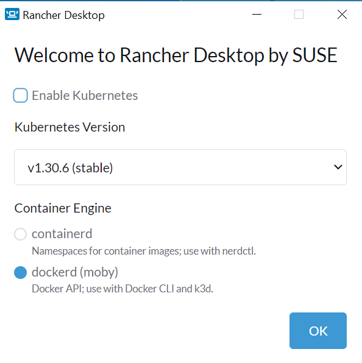
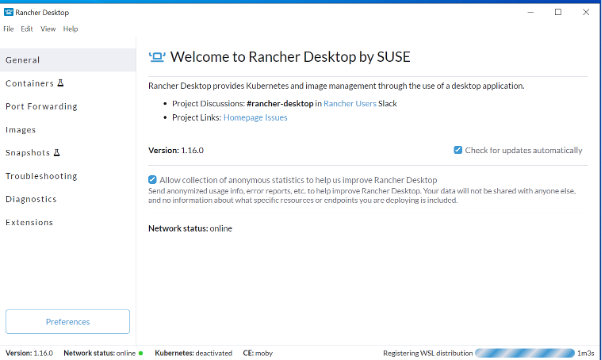

# Setup for Windows

This document describes how to set up your development environment on Windows.

We are using devcontainers. This means that we need a  system that can run containers locally on your machine. For this we will use Rancher Desktop as it is free and open source. (You can choose to use Docker Desktop or Podman Desktop instead if that is your preference).

## Rancher Desktop

The installation is straight forward and described here: [Rancher Desktop](https://docs.rancherdesktop.io/getting-started/installation/)
(The installation will automatically instal WSL2 if you dont have it already)

Download the installer and run it. Then start the app on your desktop. You will get this dialog box



We dont need kubernetes so you can remove the option. You will then be asked to restart the PC.
Click Yes and your PC restarts (maybe you dont need to restart if you let the kubernetes option on)

Start Rancher desktop and you wil se an screen like this.


Notice that it takes some time for it to be ready the first time. See in the lower right corner “Registering WSL distribution”.

This is basically all you ned to do in the Rancher Desktop. We are just going to use it to run docker containers.

## Test the docker functionality

We now need to test that the container functionality is working. Rancher Desktop is a replacement for Docker Desktop so all commands are the same.

In your Windows host open command prompt and type:

```bash
docker pull hello-world
```

You should see something like this:

```plaintext
Using default tag: latest
latest: Pulling from library/hello-world
c1ec31eb5944: Pull complete
Digest: sha256:305243c734571da2d100c8c8b3c3167a098cab6049c9a5b066b6021a60fcb966
Status: Downloaded newer image for hello-world:latest
docker.io/library/hello-world:latest
```

Now run the test by typing:

```bash
docker run hello-world
```

You should se this message:

```plaintext
Hello from Docker!
This message shows that your installation appears to be working correctly.

To generate this message, Docker took the following steps:

1. The Docker client contacted the Docker daemon.
2. The Docker daemon pulled the "hello-world" image from the Docker Hub.
    (amd64)
3. The Docker daemon created a new container from that image which runs the
    executable that produces the output you are currently reading.
4. The Docker daemon streamed that output to the Docker client, which sent it
    to your terminal.

To try something more ambitious, you can run an Ubuntu container with:
$ docker run -it ubuntu bash

Share images, automate workflows, and more with a free Docker ID:
<https://hub.docker.com/>

For more examples and ideas, visit:
<https://docs.docker.com/get-started/>
```

### Setup VSCode to use the devcontainer

See [setup-vscode.md](./setup-vscode.md)
