# Comprehensive Communication Rules and System Architecture

## Table of Contents

1. [Internal Communication](#internal-communication)
2. [External Communication](#external-communication)
3. [Requests from External Systems](#requests-from-external-systems)
4. [Inter-Service Communication](#inter-service-communication)
5. [Data Flow in Microservices Architecture](#data-flow-in-microservices-architecture)
6. [Disaster Recovery Setup](#disaster-recovery-setup)
7. [Security Layers](#security-layers)
8. [User Authentication Flow](#user-authentication-flow)
9. [CI/CD Pipeline](#cicd-pipeline)
10. [Network Architecture](#network-architecture)
11. [Database Schema](#database-schema)
12. [System States](#system-states)
13. [Gantt Chart: Project Timeline](#gantt-chart-project-timeline)
14. [Pie Chart: Resource Allocation](#pie-chart-resource-allocation)
15. [Quadrant Chart: Technology Adoption](#quadrant-chart-technology-adoption)
16. [Requirement Diagram](#requirement-diagram)
17. [Git Graph](#git-graph)

## Internal Communication

Communication between internal systems must use Azure API Management (APIM) to ensure a single point of entry, easier monitoring, and improved security.

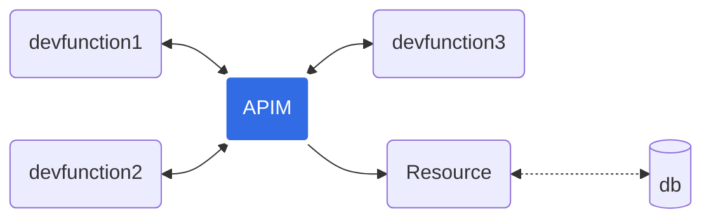

## External Communication

Communication from internal systems to external systems must use APIM to manage changes in external APIs efficiently.

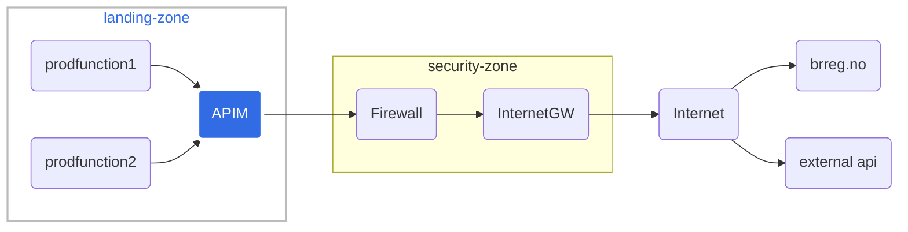

## Requests from External Systems

Requests from external systems go through the firewall and then to APIM in the landing zone.

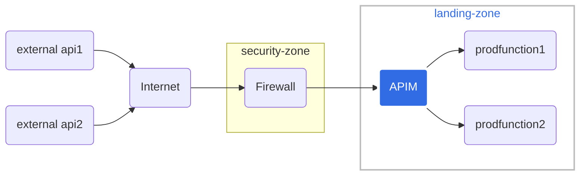

## Inter-Service Communication

Services within our ecosystem communicate through APIM for consistency, security, and scalability.

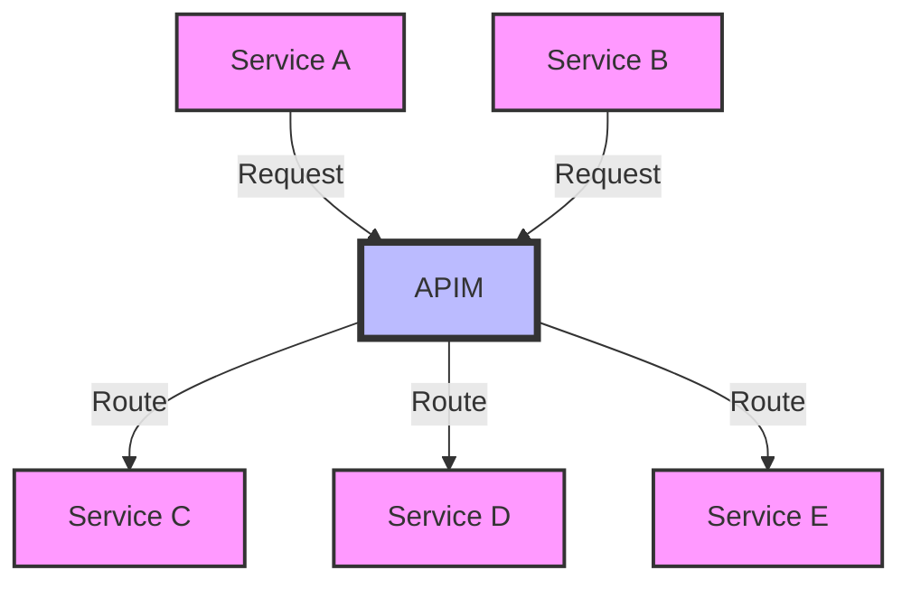

## Data Flow in Microservices Architecture

Our microservices architecture follows a specific data flow to ensure proper handling and processing of information.

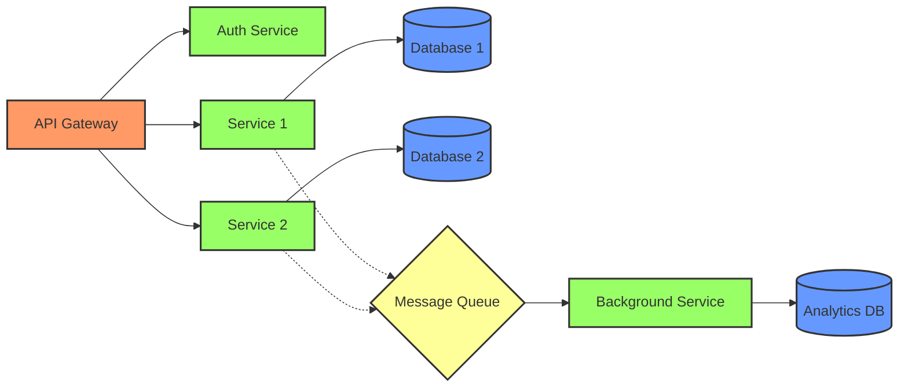

## Disaster Recovery Setup

We use Azure's geo-replication features to ensure business continuity.

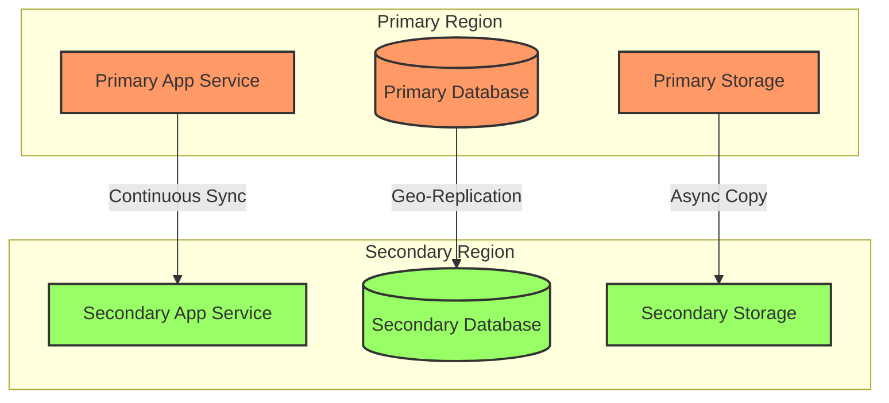

## Security Layers

Our system implements multiple security layers to protect against various threats.

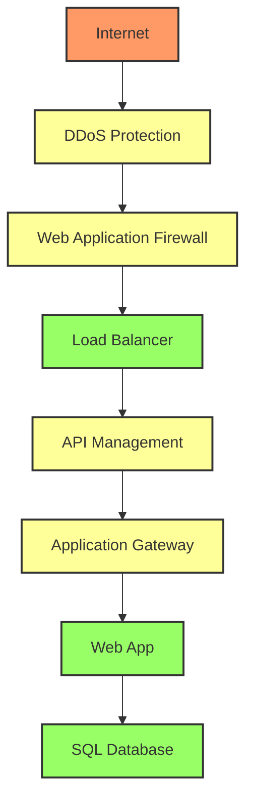

## User Authentication Flow

The sequence of steps for user authentication in our system.

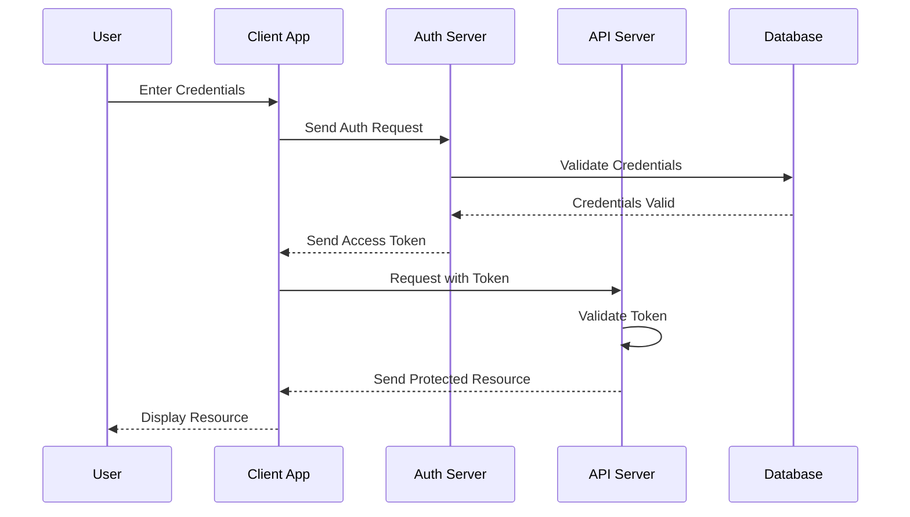

## CI/CD Pipeline

Our Continuous Integration and Continuous Deployment pipeline.

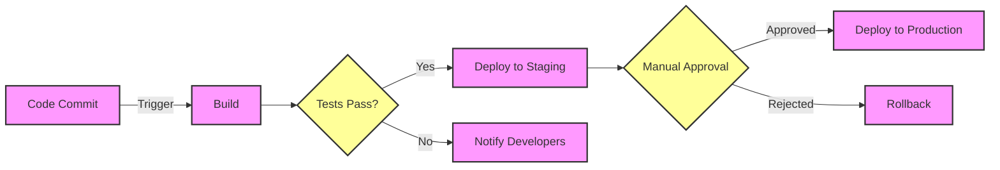

## Network Architecture

Overview of our network architecture including subnets and security groups.

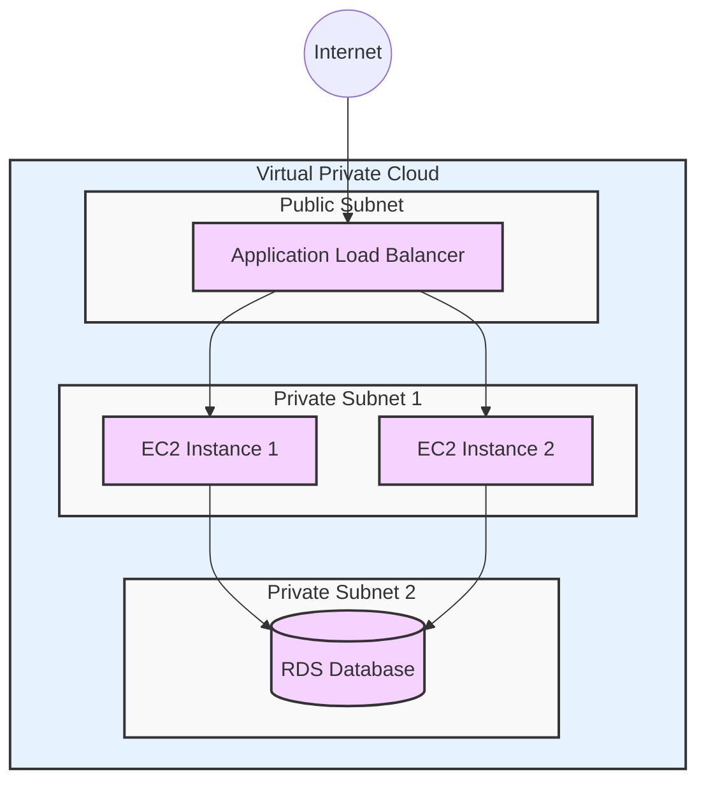

## Database Schema

Entity-Relationship Diagram (ERD) for our main database.

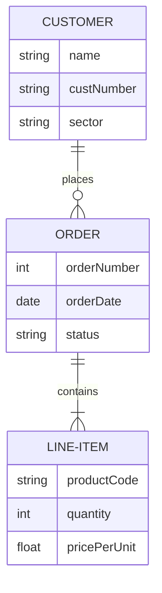

## System States

State diagram showing the possible states of our order processing system.

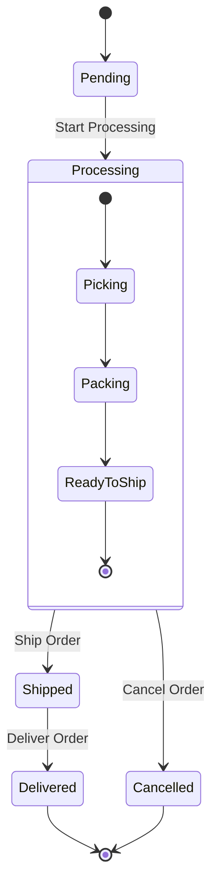

## Gantt Chart: Project Timeline

Gantt chart showing the timeline for our next major release.

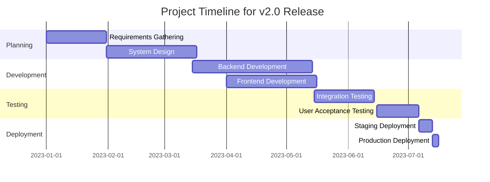

## Pie Chart: Resource Allocation

Pie chart showing the allocation of our cloud resources.

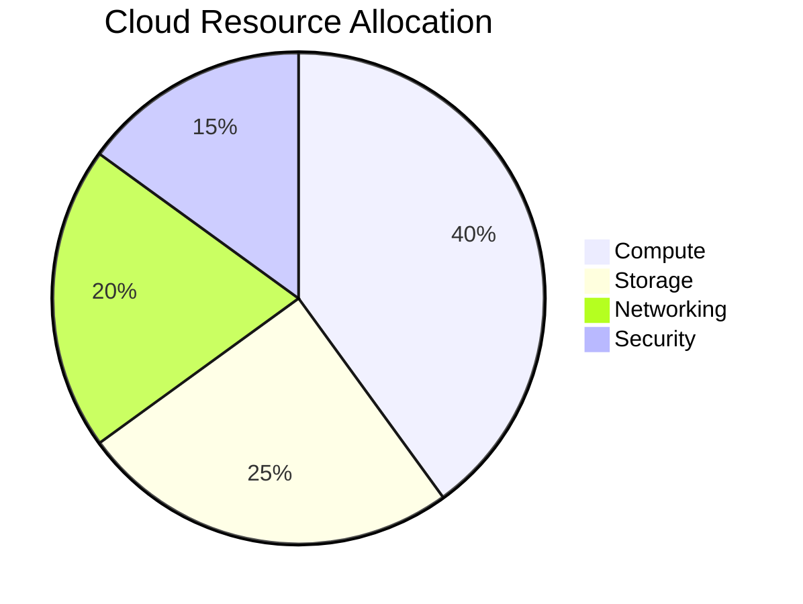

## Quadrant Chart: Technology Adoption

Quadrant chart showing our technology adoption strategy.

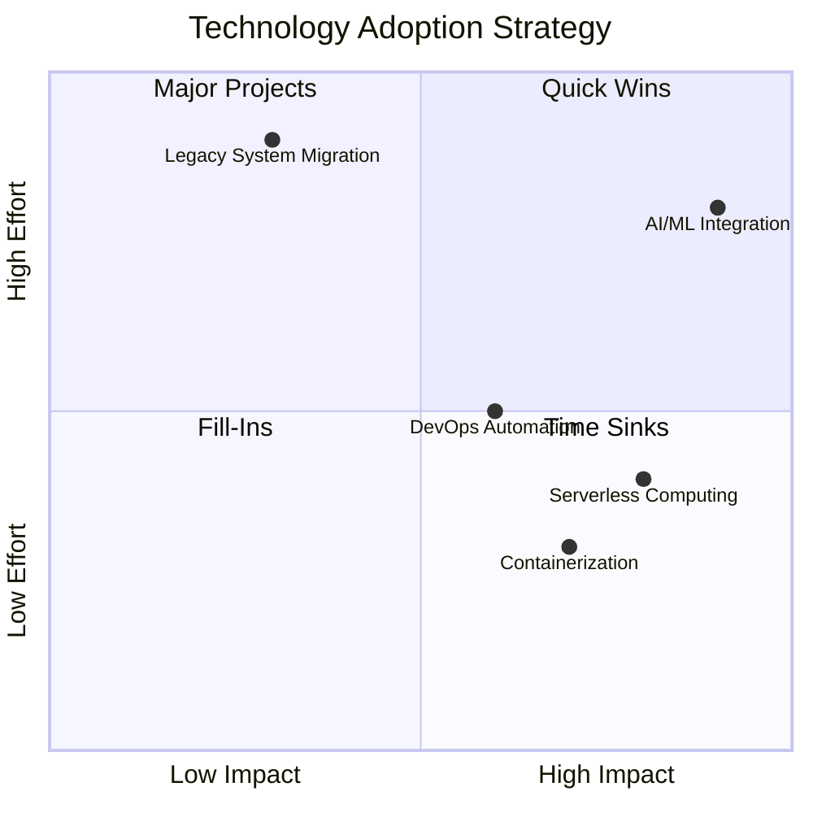

## Requirement Diagram

Requirement diagram for our new user management system.

```mermaid
requirementDiagram

    requirement UserManagement {
        id: 1
        text: The system shall provide user management capabilities
        risk: Medium
        verifymethod: Test
    }

    functionalRequirement UserRegistration {
        id: 1.1
        text: Users shall be able to register for an account
        risk: Low
        verifymethod: Demonstration
    }

    functionalRequirement UserAuthentication {
        id: 1.2
        text: Users shall be able to authenticate using username and password
        risk: High
        verifymethod: Test
    }

    UserManagement - satisfies -> UserRegistration
    UserManagement - satisfies -> UserAuthentication

    element AuthenticationModule {
        type: module
    }

    AuthenticationModule - implements -> UserAuthentication
```

## Git Graph

Git graph showing our branching and merging strategy.

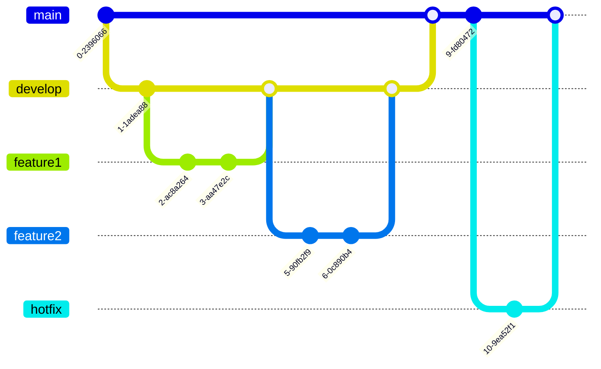

[... Previous content remains unchanged ...]

## User Authentication Process

Our user authentication process is designed to be secure, efficient, and user-friendly. It involves multiple components of our system working together to verify user credentials and grant access.


This sequence diagram illustrates the flow of information during the authentication process. It's crucial for all developers to understand this flow to maintain the security and integrity of our system.

## Order Processing States

Our e-commerce platform manages orders through various states from creation to fulfillment. Understanding these states is crucial for customer service, inventory management, and system optimization.

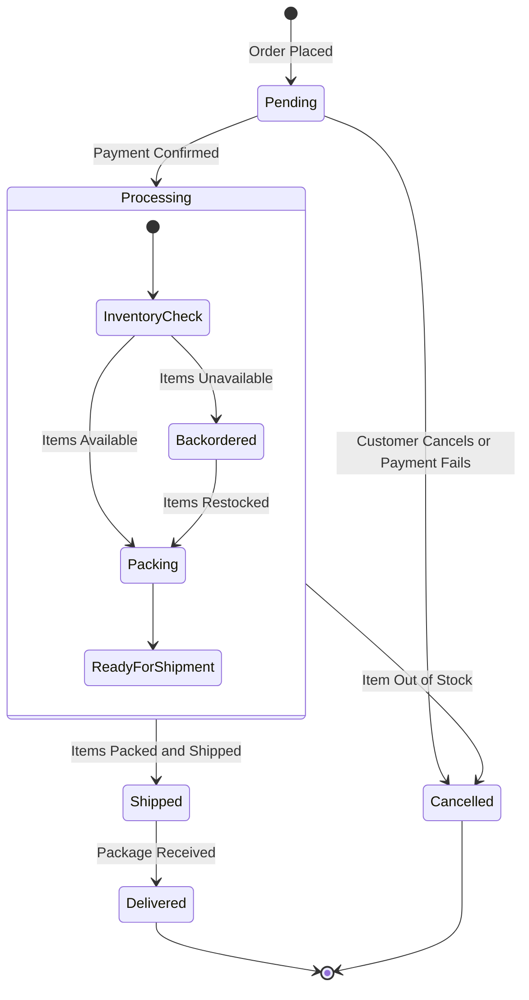

This state diagram shows the lifecycle of an order in our system. It's essential for all team members to understand these states for effective communication with customers and between departments.

## Database Schema for User Management

Our user management system relies on a well-structured database schema. This entity-relationship diagram (ERD) illustrates the relationships between key entities in our user management database.

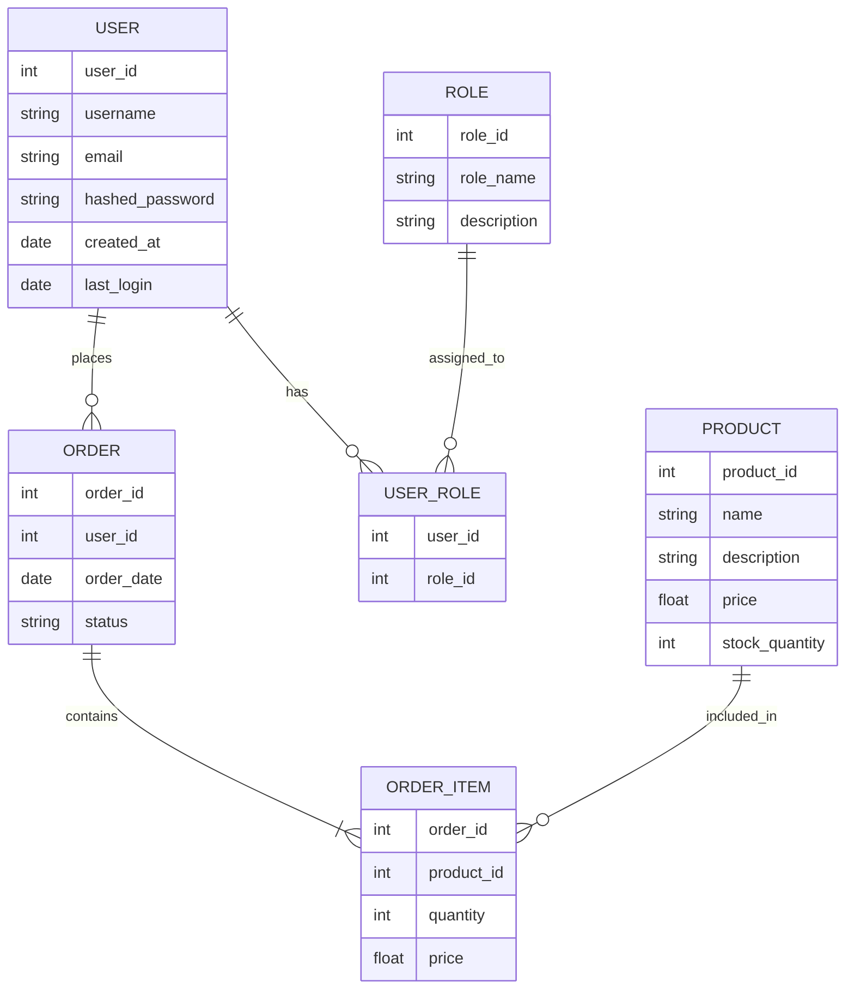

This ERD provides a clear overview of how user data, roles, orders, and products are related in our database. It's a valuable reference for developers working on user management, order processing, and inventory systems.

## Customer Journey Map

Understanding our customers' journey is crucial for improving their experience with our platform. This journey map outlines the typical steps a new customer takes from discovery to becoming a loyal user.

```mermaid
journey
    title Customer Journey on Our Platform
    section Discovery
      See advertisement: 3: Potential Customer
      Visit website: 4: Potential Customer
      Browse products: 5: Potential Customer
    section First Purchase
      Create account: 3: New Customer
      Add items to cart: 4: New Customer
      Complete checkout: 3: New Customer
      Receive order confirmation: 5: New Customer
    section Post-Purchase
      Receive product: 5: Customer
      Use product: 4: Customer
      Write review: 3: Customer
    section Retention
      Receive personalized offers: 4: Returning Customer
      Make repeat purchase: 5: Loyal Customer
      Recommend to friends: 4: Brand Advocate
```

This journey map helps our marketing, product, and customer service teams align their efforts to provide a seamless experience across all touchpoints.

## System Architecture Overview

Our system architecture is designed for scalability, reliability, and security. This C4 context diagram provides a high-level overview of our main system components and their interactions with external systems and users.

```mermaid
C4Context
    title System Architecture - Context Diagram
    Person(customer, "Customer", "A user of our e-commerce platform")
    System(webApp, "Web Application", "Provides e-commerce functionality to customers")
    System_Ext(paymentGateway, "Payment Gateway", "Processes online payments")
    System_Ext(shippingPartner, "Shipping Partner", "Manages product delivery")
    System_Ext(emailService, "Email Service", "Sends transactional emails")

    Rel(customer, webApp, "Uses")
    Rel(webApp, paymentGateway, "Processes payments using")
    Rel(webApp, shippingPartner, "Creates shipping labels and tracks packages")
    Rel(webApp, emailService, "Sends emails using")
    Rel(customer, emailService, "Receives emails from")
```

This context diagram helps team members understand the broader context of our system, including its main components and external dependencies. It's particularly useful for new team members and for discussing system-wide changes or integrations.

## Performance Monitoring

Monitoring the performance of our system is crucial for maintaining high availability and user satisfaction. We track various metrics over time to identify trends and potential issues.

```mermaid
xychart-beta
    title "System Performance Metrics (Last 12 Months)"
    x-axis [Jan, Feb, Mar, Apr, May, Jun, Jul, Aug, Sep, Oct, Nov, Dec]
    y-axis "Response Time (ms)" 0 --> 500
    line [150, 180, 200, 250, 300, 350, 400, 380, 350, 300, 280, 250]
    y-axis "Uptime (%)" 99 --> 100
    line [99.9, 99.95, 99.99, 99.98, 99.95, 99.9, 99.85, 99.9, 99.95, 99.99, 100, 99.99]
```

This chart shows our system's average response time and uptime percentage over the past year. It's important to monitor these trends and investigate any significant changes or degradations in performance.

[... Previous content remains unchanged ...]

## Project Planning Mind Map

Effective project planning is crucial for the success of our initiatives. This mind map outlines the key areas of focus for our next major system upgrade project.

```mermaid
mindmap
  root((System Upgrade Project))
    Architecture Improvements
      Microservices migration
      Load balancing optimization
      Caching strategy
    Performance Enhancements
      Database indexing
      Query optimization
      Asynchronous processing
    Security Updates
      Authentication overhaul
      Encryption upgrades
      Penetration testing
    User Experience
      UI redesign
      Mobile responsiveness
      Accessibility improvements
    DevOps
      CI/CD pipeline enhancement
      Monitoring and alerting
      Disaster recovery planning
    Testing
      Unit test coverage increase
      Integration test suite
      Automated UI testing
```

This mind map helps our team visualize the various aspects of the upgrade project, ensuring that we consider all critical areas during planning and execution.

## User Registration Sequence

Understanding the detailed flow of our user registration process is important for maintaining security and improving user experience. The following ZenUML diagram illustrates this process:

```mermaid
zenuml
    title Order Service
    @Actor Client #FFEBE6
    @Boundary OrderController #0747A6
    @EC2 <<BFF>> OrderService #E3FCEF
    group BusinessService {
      @Lambda PurchaseService
      @AzureFunction InvoiceService
    }

    @Starter(Client)
    // `POST /orders`
    OrderController.post(payload) {
      OrderService.create(payload) {
        order = new Order(payload)
        if(order != null) {
          par {
            PurchaseService.createPO(order)
            InvoiceService.createInvoice(order)
          }
        }
      }
    }
```

This sequence diagram provides a clear view of the steps involved in user registration, including input validation, database checks, and email verification. It's an essential reference for developers working on the authentication system.

## System Component Architecture

To better understand the structure of our system, we use a block diagram to represent the main components and their interactions. This high-level view helps in system design and troubleshooting.

```mermaid
block-beta
    columns 3
    doc>"Document"]:3
    space down1<[" "]>(down) space

  block:e:3
          l["left"]
          m("A wide one in the middle")
          r["right"]
  end
    space down2<[" "]>(down) space
    db[("DB")]:3
    space:3
    D space C
    db --> D
    C --> db
    D --> C
    style m fill:#d6d,stroke:#333,stroke-width:4px
```

This block diagram illustrates how different components of our system interact. It's particularly useful for new team members to understand the overall architecture and for architects when planning system changes or optimizations.

## Network Packet Structure

Understanding the structure of network packets is crucial for our network engineers and for developers working on low-level networking components. The following packet diagram shows the structure of a typical TCP/IP packet in our system:

```mermaid
packet-beta
  0-15: "Source Port"
  16-31: "Destination Port"
  32-63: "Sequence Number"
  64-95: "Acknowledgment Number"
  96-99: "Data Offset"
  100-105: "Reserved"
  106: "URG"
  107: "ACK"
  108: "PSH"
  109: "RST"
  110: "SYN"
  111: "FIN"
  112-127: "Window"
  128-143: "Checksum"
  144-159: "Urgent Pointer"
  160-191: "(Options and Padding)"
  192-255: "Data (variable length)"
```

This packet diagram is essential for our networking team to understand the structure of data as it moves through our system. It's particularly useful when debugging network issues or optimizing data transfer protocols.
